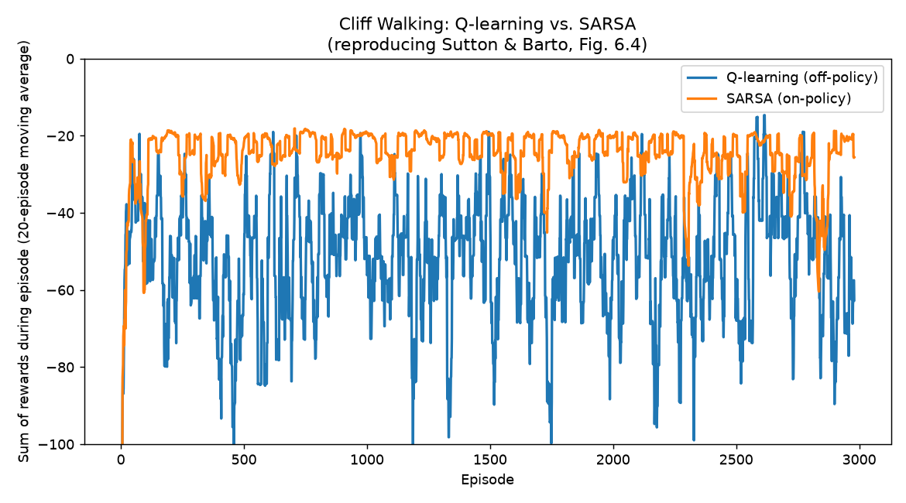
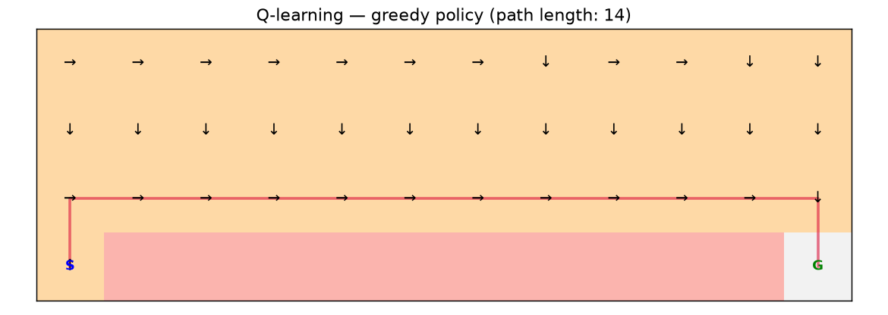
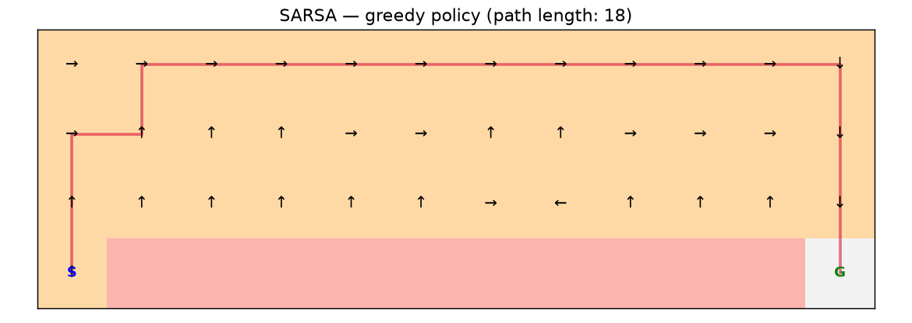

# 🧗 Cliff Walking: Q-Learning vs. SARSA

A from-scratch reproduction of a classic reinforcement-learning result:
Example 6.6 from Sutton & Barto, *Reinforcement Learning: An Introduction*
(2nd ed.) — the "Cliff Walking" gridworld, used to demonstrate the
behavioral difference between **off-policy** (Q-learning) and **on-policy**
(SARSA) temporal-difference control.

## The question this answers

Q-learning and SARSA are nearly identical algorithms — same update
structure, same exploration strategy, one line of code different. Do they
actually learn different things? This project answers that empirically, by
reproducing a textbook result rather than asserting it.

## The setup

A 4×12 grid. The agent starts bottom-left, must reach bottom-right. The
entire bottom row between them is a cliff: stepping on it costs -100 and
resets the agent to the start (episode continues). Every other step costs
-1, so the agent wants to reach the goal quickly — but the shortest path
runs right along the cliff edge, which is risky under exploration.

- **Q-learning** (off-policy): bootstraps its update off the *greedy*
  next action, regardless of what the agent actually does. It learns the
  optimal value of the optimal (risky) path even while behaving
  exploratorily.
- **SARSA** (on-policy): bootstraps off the action the agent *actually*
  takes next, including its own random exploration. It learns the value of
  the policy it's actually following — including the risk of occasionally
  exploring off the cliff — so it prefers a safer route.

## Results

| | Avg. reward, last 100 training episodes | Final greedy path length |
|---|---|---|
| **Q-learning** | −62.2 | **14** (optimal — hugs the cliff edge) |
| **SARSA** | **−22.2** | 18 (longer, but avoids the cliff edge) |

This is exactly the qualitative result from the textbook: Q-learning
converges to the *objectively optimal* path, but earns a worse *training*
reward because ε-greedy exploration occasionally sends it off the cliff
while it's walking right along the edge. SARSA converges to a policy that
accounts for its own exploration noise, and settles for a safer, longer
route — earning a better average reward during training, at the cost of
final-policy optimality.

## Quickstart

\`\`\`bash
git clone https://github.com/<your-username>/cliff-walking-rl.git
cd cliff-walking-rl
pip install -r requirements.txt

python -m unittest discover -s tests -v      # 11 tests

PYTHONPATH=src python src/evaluate.py        # trains both agents, writes reports/
\`\`\`

## Design decisions worth discussing in an interview

- **The environment is implemented from scratch**, not via `gymnasium` —
  a deliberate choice so the reset()/step() mechanics (including the
  cliff's reset-without-terminating behavior, which is easy to get wrong)
  are fully visible and unit-tested, not hidden behind a library call.
- **One shared `TDAgent` class, one-line difference.** Q-learning and
  SARSA are implemented as the *same* class with a single conditional in
  the update rule — this was deliberate, so the only variable in the
  comparison is genuinely the update target, not incidental differences
  in exploration, learning rate, or initialization between two separate
  implementations.
- **Fixed ε, not decaying.** With a fixed exploration rate, Q-learning
  *never* stops occasionally falling off the cliff during training — its
  reward curve stays noisy indefinitely even after its greedy policy has
  converged to optimal. That persistent gap between "the policy it would
  execute greedily" and "the reward it actually earns while training" is
  the whole point of the on-policy/off-policy distinction, so it's
  preserved rather than tuned away.
- **Unit tests target the update rule's math directly**, not just
  end-to-end training outcomes — e.g. `test_sarsa_bootstraps_off_actual_next_action`
  constructs a Q-table by hand and checks the exact numeric update, so a
  future refactor that accidentally reintroduces `max()` into SARSA's
  target would fail a test immediately, not just look "a bit off" after
  a full training run.

## Project structure

\`\`\`
├── src/
│   ├── environment.py   # CliffWalkingEnv, from scratch, gym-like interface
│   ├── q_learning.py    # shared TDAgent (Q-learning / SARSA), training loop
│   └── evaluate.py       # learning curves, policy visualizations
├── tests/                # 11 unit tests (environment mechanics, update rules)
└── reports/               # metrics.json, plots
\`\`\`

## Reference

Sutton, R. S., & Barto, A. G. (2018). *Reinforcement Learning: An
Introduction* (2nd ed.), Example 6.6, "Cliff Walking." MIT Press.

## License

MIT
